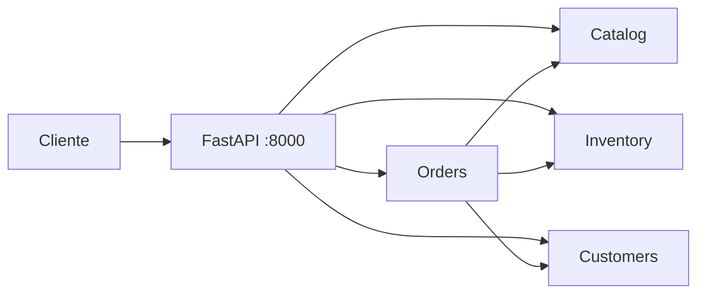
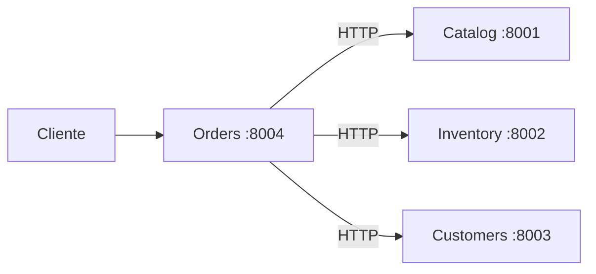

---

# De Monolito a Microservicios

## EDUGEM Store · `monolith/` → `v1/`

---

# Agenda

1. ¿Qué migramos?
2. Arquitectura: antes y después
3. Carpetas y despliegue
4. API y datos (Base de datos - Per service - Concurrencia de la base de datos)
5. Código: Catalog
6. Código: Inventario
7. Código: Pedidos (el caso clave)
8. Resumen y demo


- Concurrencia de una base de datos
  - Dos servicios acceden al mismo registro al mismo tiempo 
    - Juan quiere actualizar el nombre de su cliente  client_name=Jose
    - Admin quiere actualizar el nombre de su cliente client_name= Jose Cruz
      - Peticion al mismo timpo (No es importante por que el nombre del cliente puede ser editado nuevamente)
  - Pagos en linea
    - Pedro compra una pieza (Realiza el pago) -> Servicio de pagos (Toma un tiempo)
    - Actualizar la base de datos con el pedido -> Registrar que Pedro pidio una pieza 
    - Pedro cancela la compra 
    - Banderas en la base de datos (Tabla - > Estados -> Compra Pagos Registro)
      - Su pedido esta en proceso de cobro!

---

> **La lógica de negocio no cambia.**  
> **Cambia cómo se organiza y se comunica el código.**


| Igual en ambos              | Diferente                                |
| --------------------------- | ---------------------------------------- |
| Reservar stock              | 1 proceso vs 4 procesos                  |
| Confirmar / cancelar pedido | `import` local vs HTTP                   |
| JSON como “base de datos”   | 1 carpeta `data/` vs 1 JSON por servicio |


---

# Antes: Monolito modular




- **1 contenedor** · **1 puerto** · **8000**
- Dominios separados en código, unidos en runtime

---

# Después: Microservicios v1




- **4 contenedores** · **4 puertos** · **8001–8004**
- Cada dominio = servicio desplegable por separado

---

# Tabla comparativa rápida


|                  | Monolito         | Microservicios v1  |
| ---------------- | ---------------- | ------------------ |
| Procesos         | 1                | 4                  |
| Puerto principal | 8000             | 8001–8004          |
| Comunicación     | Python `import`  | REST + `httpx`     |
| Datos            | `monolith/data/` | `services/*/data/` |
| Eventos          | Bus interno      | *(próxima clase)*  |


---

# Estructura de carpetas

## Monolito

```
monolith/app/domains/
  ├── catalog/
  ├── inventory/
  ├── customers/
  └── orders/
monolith/data/          ← todos los JSON aquí
```

## Microservicios

```
v1/services/
  ├── catalog/    + Dockerfile + data/
  ├── inventory/
  ├── customers/
  └── orders/       ← orquesta por HTTP
```

**Regla:** `domains/<x>/` → `services/<x>/`

---

# Docker Compose

## Monolito — 1 servicio

```yaml
services:
  store-monolith:
    ports: ["8000:8000"]
    volumes: ["./data:/app/data"]
```

## v1 — 4 servicios

```yaml
orders-service:
  environment:
    CATALOG_BASE_URL: http://catalog-service:8001
    INVENTORY_BASE_URL: http://inventory-service:8002
    CUSTOMERS_BASE_URL: http://customers-service:8003
```

**Idea:** Orders ya no importa Catalog; le habla por red interna Docker.

---

# Rutas de la API


| Recurso   | Monolito                            | Microservicio         |
| --------- | ----------------------------------- | --------------------- |
| Productos | `GET :8000/api/v1/catalog/products` | `GET :8001/products`  |
| Stock     | `GET :8000/api/v1/inventory/stock`  | `GET :8002/stock`     |
| Clientes  | `GET :8000/api/v1/customers`        | `GET :8003/customers` |
| Pedidos   | `POST :8000/api/v1/orders`          | `POST :8004/orders`   |


*Próximo paso: API Gateway para unificar de nuevo en `:8000`*

---

# Persistencia

## Patrón: *database per service* (simulado con JSON)


| Monolito                              | Microservicios                        |
| ------------------------------------- | ------------------------------------- |
| `products.json` en `data/` compartida | `services/catalog/data/products.json` |
| Clase `JsonStore` reutilizable        | Lectura directa en cada `main.py`     |
| Lock en memoria (1 proceso)           | Cada servicio escribe solo su archivo |


---

# Código Catalog

## Monolito — repositorio local

```python
# monolith/app/domains/catalog/repository.py
_store = JsonStore(..., "products.json")

def get_product(product_id: str) -> Product | None:
    for p in _store.read():
        if p["id"] == product_id:
            return Product(**p)
```

## Microservicios — API propia

```python
# v1/services/catalog/app/main.py
@app.get("/products/{product_id}")
def get_product(product_id: str) -> dict:
    ...
```

---

# Código Inventario

## Monolito — función interna

```python
# monolith — inventory/repository.py
def reserve(product_id: str, quantity: int) -> StockItem:
    # valida stock y aumenta "reserved"
```

Llamada desde Orders: `inventory_repo.reserve(...)`

## Microservicios — endpoint HTTP

```python
# v1 — inventory/app/main.py
@app.post("/stock/reserve")
def reserve_stock(payload: StockRequest) -> dict:
    ...
```

Llamada desde Orders: `httpx.post(.../stock/reserve)`

---

# Pedidos: el cambio más importante

## Monolito = llamadas en memoria

```python
from app.domains.catalog import repository as catalog_repo
from app.domains.inventory import repository as inventory_repo

product = catalog_repo.get_product(item.product_id)
inventory_repo.reserve(line.product_id, line.quantity)
```

✅ Rápido · ✅ Transacción local · ❌ Todo acoplado al mismo proceso

---

# Pedidos: microservicios

## v1 = orquestación HTTP

```python
CATALOG_BASE_URL = "http://catalog-service:8001"
INVENTORY_BASE_URL = "http://inventory-service:8002"

product = client.get(f"{CATALOG_BASE_URL}/products/{id}").json()
client.post(f"{INVENTORY_BASE_URL}/stock/reserve", json={...})
```

✅ Servicios independientes · ❌ Latencia de red · ❌ Hay que compensar fallos

---

# Mismo flujo, distinto mecanismo


| Paso         | Monolito                        | Microservicios        |
| ------------ | ------------------------------- | --------------------- |
| 1. Cliente   | `customers_repo.get_customer()` | `GET /customers/{id}` |
| 2. Producto  | `catalog_repo.get_product()`    | `GET /products/{id}`  |
| 3. Reservar  | `inventory_repo.reserve()`      | `POST /stock/reserve` |
| 4. Error     | `release_reservation()`         | `POST /stock/release` |
| 5. Confirmar | `commit_reservation()`          | `POST /stock/commit`  |


**La Saga es la misma; el transporte cambió.**

---

# Compensación al fallar

## Monolito

```python
except ValueError:
    for product_id, qty in reservations:
        inventory_repo.release_reservation(product_id, qty)
```

## Microservicios

```python
except HTTPException:
    for r in reservations:
        client.post(f"{INVENTORY_BASE_URL}/stock/release", json=r)
```

**Misma idea:** deshacer reservas si algo falla a mitad del flujo.

---

# Eventos (solo monolito por ahora)

## Monolito

```python
event_bus.publish(DomainEvent(
    event_type="order.created",
    aggregate_id=order.id,
))
```

- Bus **in-process**
- Log en `data/events.jsonl`

## v1

- Sin cola aún
- **Siguiente clase:** RabbitMQ / Redis + eventos entre servicios

---

# Mapa de migración


| #   | Extraer   | De                   | A                     |
| --- | --------- | -------------------- | --------------------- |
| 1   | Catalog   | `domains/catalog/`   | `services/catalog/`   |
| 2   | Inventory | `domains/inventory/` | `services/inventory/` |
| 3   | Customers | `domains/customers/` | `services/customers/` |
| 4   | Orders    | `domains/orders/`    | `services/orders/`    |


**Orders siempre al final** (depende de los demás).

---

# Conclusiones

1. Empezamos con **monolito modular** (código separado, un despliegue).
2. Extraemos por **bounded context** → microservicio + JSON propio.
3. **Orders** pasa de `import` a **HTTP** (orquestación).
4. La lógica de negocio se mantiene; sube la complejidad operativa.
5. **Próximo:** API Gateway · cola de eventos · observabilidad.

---

