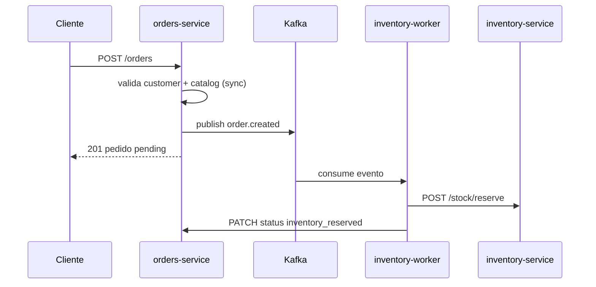

# EDUGEM Store v2 — Microservicios + Kafka (EDA)

Evolución de `v1/`: las APIs **publican eventos** en Kafka y los **workers consumen** y llaman a la siguiente API.

## Idea educativa

```
Cliente
   │
   ▼
orders-service (API)  ──publica──►  Kafka topic: store-events
                                         │
                    ┌────────────────────┴────────────────────┐
                    ▼                                         ▼
         inventory-worker                          notification-worker
         (llama inventory API)                     (simula email / log)
```


| v1 (síncrono)                               | v2 (EDA)                                     |
| ------------------------------------------- | -------------------------------------------- |
| `orders` llama `inventory` por HTTP directo | `orders` publica evento en Kafka             |
| Todo en la misma petición                   | Worker consume y llama `POST /stock/reserve` |
| Acoplamiento fuerte                         | Desacoplamiento por eventos                  |


## Eventos del topic `store-events`


| event_type      | Quién publica  | Quién consume       | Acción                      |
| --------------- | -------------- | ------------------- | --------------------------- |
| `order.created` | orders-service | inventory-worker    | `POST /stock/reserve`       |
| `order.confirm` | orders-service | inventory-worker    | `POST /stock/commit`        |
| `order.cancel`  | orders-service | inventory-worker    | `POST /stock/release`       |
| `*`             | orders-service | notification-worker | Log / notificación simulada |


## Levantar (Linux VM)

```bash
cd v2
docker compose up --build -d
docker compose ps
docker compose logs -f inventory-worker
```

## URLs


| Componente         | URL                                                      |
| ------------------ | -------------------------------------------------------- |
| Orders API         | [http://localhost:8004/docs](http://localhost:8004/docs) |
| Kafdrop (UI Kafka) | [http://localhost:9001](http://localhost:9001)           |
| Kafka (host)       | localhost:9092                                           |


## Demo en clase

### 1. Crear pedido (API publica evento)

```bash
curl -s -X POST http://localhost:8004/orders \
  -H "Content-Type: application/json" \
  -d '{
    "customer_id": "cust-001",
    "items": [{"product_id": "prod-001", "quantity": 2}]
  }' | jq
```

Respuesta inmediata: pedido `pending`. El worker reserva stock **de forma asíncrona**.

### 2. Ver logs del consumer

```bash
docker compose logs -f inventory-worker
# [inventory-worker] order.created -> POST /stock/reserve prod-001 x2
```

### 3. Confirmar pedido (otro evento)

```bash
curl -s -X POST http://localhost:8004/orders/<ORDER_ID>/confirm | jq
docker compose logs -f inventory-worker
# [inventory-worker] order.confirm -> POST /stock/commit
```

### 4. Ver mensajes en Kafdrop

Abrir [http://localhost:9001](http://localhost:9001) → topic `store-events`.

## Flujo completo




## Relación con carpeta EDA/


| EDA (curso Kafka)           | v2 (tienda)                            |
| --------------------------- | -------------------------------------- |
| `kafka_producer.py`         | `orders-service` publica eventos       |
| `consumer_inventory.py`     | `inventory-worker` + llamada HTTP real |
| `consumer_notifications.py` | `notification-worker`                  |
| topic `orders`              | topic `store-events`                   |


## Próxima clase

- API Gateway
- Dead letter queue (DLQ) si falla reserve
- Idempotencia en consumers

