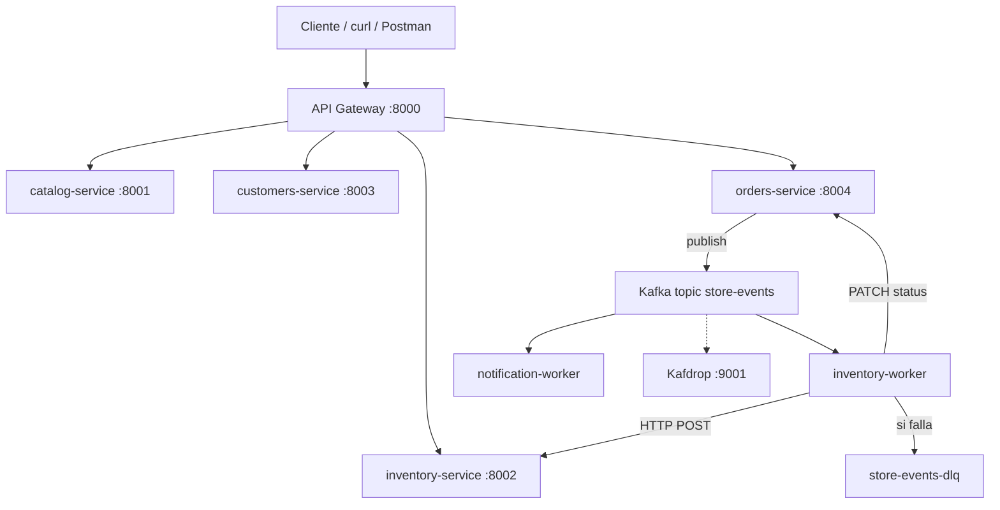
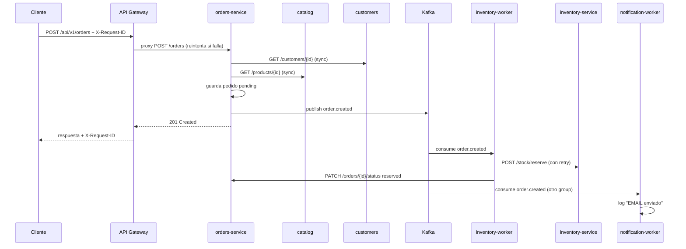

# EDUGEM Store  — Proyecto integrador 

Arquitectura **cloud native completa** para la tienda EDUGEM: microservicios, Kafka (EDA), API Gateway, observabilidad y resiliencia. Este documento explica **qué hace cada pieza**, **por qué existe** y muestra el **código clave** del repositorio.

---

## 1. Contexto: evolución del curso

El mismo dominio de negocio (tienda online) evoluciona en cuatro etapas. Cada carpeta añade un patrón arquitectónico sin reescribir la lógica desde cero.


| Etapa | Carpeta     | Qué aprendes                                                                     |
| ----- | ----------- | -------------------------------------------------------------------------------- |
| 1     | `monolith/` | Monolito modular: dominios separados en código, un solo despliegue               |
| 2     | `v1/`       | Microservicios: cada dominio es un contenedor; comunicación HTTP síncrona        |
| 3     | `v2/`       | EDA: la API publica eventos en Kafka; un worker consume y llama la siguiente API |
| 4     | `**v3/`**   | Cloud native: API Gateway, trazabilidad, retry, rate limit y DLQ                 |


**Mensaje central de v3:** el cliente ya no habla con cuatro puertos distintos. Hay **una sola entrada** (`:8000`), los servicios internos están ocultos, y cada petición puede seguirse con un `X-Request-ID` a través de gateway → orders → Kafka → workers → inventory.

---

## 2. Arquitectura general




### Componentes y responsabilidades


| Componente            | Rol                                                      | ¿Expuesto al host?   |
| --------------------- | -------------------------------------------------------- | -------------------- |
| `api-gateway`         | Enrutamiento, rate limit, retry, health agregado         | Sí → `:8000`         |
| `catalog-service`     | Catálogo de productos                                    | No (solo red Docker) |
| `inventory-service`   | Stock, reserva, commit, release                          | No                   |
| `customers-service`   | Clientes                                                 | No                   |
| `orders-service`      | Pedidos; valida y publica eventos Kafka                  | No                   |
| `inventory-worker`    | Consumer: lee Kafka y llama inventory + actualiza orders | No                   |
| `notification-worker` | Consumer paralelo: simula emails                         | No                   |
| `kafka` + `zookeeper` | Broker de mensajes                                       | `:9092` (debug)      |
| `kafdrop`             | UI para ver topics y mensajes                            | Sí → `:9001`         |


---

## 3. Flujo completo: crear un pedido

Este es el recorrido que debes poder explicar en la presentación final.




### Por qué parte es síncrona y parte asíncrona

- **Síncrono (orders → customers, catalog):** debes rechazar el pedido de inmediato si el cliente o el producto no existen. No tiene sentido publicar un evento inválido.
- **Asíncrono (orders → Kafka → inventory-worker):** reservar stock puede tardar o reintentarse; el cliente recibe respuesta rápida y el inventario se procesa en background. Es el patrón **event-driven** del curso Kafka (`EDA/`).

### Estados del pedido


| Campo              | Valores                                                         | Quién lo cambia           |
| ------------------ | --------------------------------------------------------------- | ------------------------- |
| `status`           | `pending` → `confirming` → `confirmed` / `failed` / `cancelled` | orders + inventory-worker |
| `inventory_status` | `awaiting_reserve` → `reserved` → `committed`                   | inventory-worker          |


---

## 4. Docker Compose: orquestación del sistema

El archivo `docker-compose.yml` levanta **10 servicios** en una red interna. Los microservicios no publican puertos al host; solo el gateway y Kafdrop son visibles desde fuera.

```yaml
# v3/docker-compose.yml (fragmentos clave)

  orders-service:
    environment:
      KAFKA_BOOTSTRAP_SERVERS: kafka:29092
      KAFKA_TOPIC: store-events
      CATALOG_BASE_URL: http://catalog-service:8001
      CUSTOMERS_BASE_URL: http://customers-service:8003
    depends_on:
      - kafka
      - catalog-service
      - customers-service

  inventory-worker:
    environment:
      KAFKA_TOPIC: store-events
      KAFKA_DLQ_TOPIC: store-events-dlq
      INVENTORY_BASE_URL: http://inventory-service:8002
      ORDERS_BASE_URL: http://orders-service:8004
      HTTP_RETRIES: "3"
    restart: unless-stopped

  api-gateway:
    ports:
      - "8000:8000"
    environment:
      CATALOG_URL: http://catalog-service:8001
      INVENTORY_URL: http://inventory-service:8002
      CUSTOMERS_URL: http://customers-service:8003
      ORDERS_URL: http://orders-service:8004
      RATE_LIMIT_PER_MINUTE: "60"
```

**Detalle importante:** dentro de Docker los servicios se llaman por nombre (`catalog-service`, `kafka:29092`). Desde tu PC usas `localhost:8000` (gateway) o `localhost:9001` (Kafdrop).

---

## 5. API Gateway — entrada única del sistema

**Archivo:** `gateway/app/main.py`

El gateway resuelve tres problemas de v3:

1. **Un solo punto de entrada** para el cliente (`/api/v1/`*).
2. **Políticas transversales** (rate limit, timeout, retry) sin repetirlas en cada microservicio.
3. **Observabilidad:** genera o reenvía `X-Request-ID` y mide tiempo de respuesta.

### 5.1 Middleware de observabilidad

Cada petición recibe un identificador. Si el cliente envía `X-Request-ID`, se respeta; si no, se genera uno nuevo.

```python
# gateway/app/main.py

@app.middleware("http")
async def observability_middleware(request: Request, call_next):
    request_id = get_request_id(request)  # header o uuid4()
    request.state.request_id = request_id
    start = time.perf_counter()
    response = await call_next(request)
    elapsed_ms = round((time.perf_counter() - start) * 1000, 2)
    response.headers["X-Request-ID"] = request_id
    response.headers["X-Response-Time-Ms"] = str(elapsed_ms)
    logger.info("request_id=%s %s %s %sms", request_id, request.method, request.url.path, elapsed_ms)
    return response
```

En clase: crea un pedido con `-H "X-Request-ID: demo-001"` y busca ese ID en todos los logs:

```bash
docker compose logs | grep demo-001
```

### 5.2 Proxy con retry y timeout

Si un microservicio no responde (timeout o conexión rechazada), el gateway reintenta hasta 3 veces antes de devolver `503`.

```python
# gateway/app/main.py

async def proxy_request(request: Request, base_url: str, path: str, request_id: str) -> Response:
    url = f"{base_url.rstrip('/')}/{path.lstrip('/')}"
    headers = {"X-Request-ID": request_id, ...}

    for attempt in range(1, HTTP_RETRIES + 1):
        try:
            async with httpx.AsyncClient(timeout=HTTP_TIMEOUT) as client:
                resp = await client.request(request.method, url, content=body, headers=headers)
            return Response(content=resp.content, status_code=resp.status_code, ...)
        except (httpx.TimeoutException, httpx.ConnectError) as exc:
            await asyncio.sleep(0.5 * attempt)  # backoff

    raise HTTPException(status_code=503, detail="Servicio no disponible tras N intentos")
```

### 5.3 Rate limiting

Protección básica contra abuso: máximo 60 peticiones por minuto por IP.

```python
# gateway/app/main.py

def check_rate_limit(client_ip: str) -> None:
    now = time.time()
    window = [t for t in _request_log[client_ip] if now - t < 60]
    if len(window) >= RATE_LIMIT:
        raise HTTPException(status_code=429, detail="Rate limit excedido")
```

### 5.4 Health agregado

`GET /health` en el gateway consulta el `/health` de cada microservicio y devuelve un resumen.

```python
# gateway/app/main.py

@app.get("/health")
async def health() -> dict:
    checks = {"gateway": "ok"}
    async with httpx.AsyncClient(timeout=5.0) as client:
        for name, url in [("catalog", CATALOG_URL), ("inventory", INVENTORY_URL), ...]:
            try:
                resp = await client.get(f"{url}/health")
                checks[name] = "ok" if resp.status_code == 200 else "degraded"
            except httpx.HTTPError:
                checks[name] = "down"
    return {"status": "ok" if all(v == "ok" for v in checks.values()) else "degraded", "services": checks}
```

### 5.5 Tabla de rutas


| Petición al Gateway                | Se reenvía a                                     |
| ---------------------------------- | ------------------------------------------------ |
| `GET /api/v1/catalog/products`     | `http://catalog-service:8001/products`           |
| `GET /api/v1/inventory/stock`      | `http://inventory-service:8002/stock`            |
| `GET /api/v1/customers`            | `http://customers-service:8003/customers`        |
| `POST /api/v1/orders`              | `http://orders-service:8004/orders`              |
| `POST /api/v1/orders/{id}/confirm` | `http://orders-service:8004/orders/{id}/confirm` |


```python
# gateway/app/main.py

@app.api_route("/api/v1/orders{path:path}", methods=["GET", "POST", "PATCH", "PUT", "DELETE"])
async def orders_proxy(request: Request, path: str) -> Response:
    check_rate_limit(request.client.host if request.client else "unknown")
    return await proxy_request(request, ORDERS_URL, f"orders{path}", request.state.request_id)
```

---

## 6. orders-service — productor de eventos Kafka

**Archivos:** `services/orders/app/main.py`, `services/orders/app/kafka_client.py`

En v1, orders llamaba a inventory por HTTP en la misma petición. En v2/v3, orders **publica un evento** y un worker hace el trabajo pesado.

### 6.1 Crear pedido: validación sync + evento async

```python
# services/orders/app/main.py

@app.post("/orders", status_code=201)
def create_order(request: Request, payload: CreateOrderRequest) -> dict:
    # 1. Validar cliente y productos (HTTP síncrono a otros microservicios)
    with httpx.Client(timeout=10.0) as client:
        customer_resp = client.get(f"{CUSTOMERS_BASE_URL}/customers/{payload.customer_id}")
        product_resp = client.get(f"{CATALOG_BASE_URL}/products/{item.product_id}")
        ...

    # 2. Guardar pedido en JSON local (database per service)
    order = {
        "id": order_id,
        "status": "pending",
        "inventory_status": "awaiting_reserve",
        "items": lines,
        "total": round(total, 2),
    }
    save_order(order)

    # 3. Publicar evento en Kafka (NO llama inventory aquí)
    rid = _request_id(request)
    publish_event({
        "event_type": "order.created",
        "request_id": rid,
        "order_id": order_id,
        "items": [{"product_id": l["product_id"], "quantity": l["quantity"]} for l in lines],
        ...
    })

    return {**order, "message": "Inventario se procesara de forma asincrona via Kafka."}
```

### 6.2 Cliente Kafka (producer)

Misma idea que `EDA/kafka_producer.py`, integrado al servicio de pedidos.

```python
# services/orders/app/kafka_client.py

def get_producer() -> KafkaProducer:
    _producer = KafkaProducer(
        bootstrap_servers=KAFKA_BOOTSTRAP,
        value_serializer=lambda v: json.dumps(v).encode("utf-8"),
    )
    return _producer

def publish_event(event: dict) -> None:
    producer = get_producer()
    producer.send(KAFKA_TOPIC, value=event)  # topic: store-events
    producer.flush()
```

### 6.3 Callback para el worker

El worker no escribe directamente en `orders.json`. Llama a un endpoint interno para actualizar estado:

```python
# services/orders/app/main.py

@app.patch("/orders/{order_id}/status")
def update_status(order_id: str, payload: StatusUpdate) -> dict:
    """Callback interno: lo usa inventory-worker tras procesar el evento."""
    order["status"] = payload.status
    order["inventory_status"] = payload.inventory_status
    write_orders(data)
    return order
```

### 6.4 Confirmar y cancelar (más eventos)

```python
# services/orders/app/main.py

@app.post("/orders/{order_id}/confirm")
def confirm_order(request: Request, order_id: str) -> dict:
    if order.get("inventory_status") != "reserved":
        raise HTTPException(400, "Inventario aun no reservado por el worker")

    publish_event({
        "event_type": "order.confirm",
        "request_id": _request_id(request),
        "order_id": order_id,
        "items": [...],
    })
    return {"status": "confirming", "message": "Worker llamara inventory-service."}
```

---

## 7. inventory-worker — consumer que llama la API

**Archivo:** `workers/inventory-worker/worker.py`

Este es el corazón pedagógico que conecta el curso **EDA/** con la tienda:

> **API publica mensaje → consumer hace el llamado a la siguiente API**

### 7.1 Suscripción a Kafka

```python
# workers/inventory-worker/worker.py

consumer = KafkaConsumer(
    KAFKA_TOPIC,                    # store-events
    bootstrap_servers=KAFKA_BOOTSTRAP,
    group_id=KAFKA_GROUP,           # inventory-worker-group
    auto_offset_reset="earliest",
    value_deserializer=lambda x: json.loads(x.decode("utf-8")),
)

for message in consumer:
    event = message.value
    process_event(client, dlq_producer, event)
```

Comparación con el curso:


| `EDA/consumer_inventory.py` | `v3/inventory-worker`            |
| --------------------------- | -------------------------------- |
| Solo imprime en consola     | Llama `POST /stock/reserve` real |
| Topic `orders`              | Topic `store-events`             |
| Sin retry ni DLQ            | Retry 3x + DLQ si falla          |


### 7.2 Procesar `order.created` → reservar stock

```python
# workers/inventory-worker/worker.py

def handle_order_created(client, producer, event: dict) -> None:
    request_id = event.get("request_id", order_id)

    try:
        for item in event["items"]:
            http_post_with_retry(
                client,
                f"{INVENTORY_URL}/stock/reserve",
                {"product_id": item["product_id"], "quantity": item["quantity"]},
                request_id,
            )
        patch_order_status(client, order_id, "pending", "reserved", request_id)

    except httpx.HTTPError as exc:
        patch_order_status(client, order_id, "failed", "reserve_failed", request_id)
        publish_dlq(producer, event, str(exc))  # → topic store-events-dlq
```

### 7.3 Retry en llamadas HTTP

```python
# workers/inventory-worker/worker.py

def http_post_with_retry(client, url, payload, request_id) -> None:
    for attempt in range(1, HTTP_RETRIES + 1):
        try:
            resp = client.post(url, json=payload, headers={"X-Request-ID": request_id})
            resp.raise_for_status()
            return
        except httpx.HTTPError as exc:
            time.sleep(0.5 * attempt)
    raise last_error
```

### 7.4 Dead Letter Queue (DLQ)

Si después de los reintentos sigue fallando, el evento no se pierde: va a otro topic para análisis manual o reproceso.

```python
# workers/inventory-worker/worker.py

def publish_dlq(producer, event: dict, error: str) -> None:
    payload = {**event, "dlq_reason": error, "dlq_at": time.time()}
    producer.send(KAFKA_DLQ_TOPIC, value=payload)  # store-events-dlq
    producer.flush()
```

Ver DLQ en Kafdrop: [http://localhost:9001](http://localhost:9001) → topic `store-events-dlq`.

---

## 8. inventory-service — API de stock

**Archivo:** `services/inventory/app/main.py`

El worker no toca el JSON directamente; usa la API REST del servicio (límite claro entre procesos).

```python
# services/inventory/app/main.py

@app.post("/stock/reserve")
def reserve_stock(payload: StockRequest) -> dict:
    available = item["quantity"] - item.get("reserved", 0)
    if available < payload.quantity:
        raise HTTPException(status_code=400, detail="Stock insuficiente")
    item["reserved"] = item.get("reserved", 0) + payload.quantity
    write_stock(stock)
    return item

@app.post("/stock/commit")
def commit_stock(payload: StockRequest) -> dict:
    item["reserved"] -= payload.quantity
    item["quantity"] -= payload.quantity
    write_stock(stock)
    return item
```

---

## 9. notification-worker — segundo consumer (mismo topic)

**Archivo:** `workers/notification-worker/worker.py`

Demuestra que **varios consumers** pueden leer el mismo topic con **distinto `group_id`**:

- `inventory-worker-group` → reserva stock
- `notification-worker-group` → simula email

```python
# workers/notification-worker/worker.py

def notify(event: dict) -> None:
    request_id = event.get("request_id", "-")
    if event_type == "order.created":
        logger.info(
            "request_id=%s EMAIL -> Hola %s, pedido %s (total: %s)",
            request_id, customer, order_id, event.get("total"),
        )
```

Equivalente educativo de `EDA/consumer_notifications.py`, pero con datos reales del pedido.

---

## 10. Eventos del topic `store-events`


| event_type      | Publicado por               | Consumido por       | Acción HTTP           |
| --------------- | --------------------------- | ------------------- | --------------------- |
| `order.created` | `POST /orders`              | inventory-worker    | `POST /stock/reserve` |
| `order.created` | `POST /orders`              | notification-worker | log email             |
| `order.confirm` | `POST /orders/{id}/confirm` | inventory-worker    | `POST /stock/commit`  |
| `order.cancel`  | `POST /orders/{id}/cancel`  | inventory-worker    | `POST /stock/release` |


Ejemplo de payload:

```json
{
  "event_type": "order.created",
  "request_id": "demo-curso-001",
  "order_id": "uuid-del-pedido",
  "customer_id": "cust-001",
  "customer_name": "Ana Garcia",
  "items": [{"product_id": "prod-001", "quantity": 2}],
  "total": 159.98
}
```

---

## 11. Patrones del temario implementados en v3


| Tema del curso                    | Dónde está en v3                                               |
| --------------------------------- | -------------------------------------------------------------- |
| Microservicios / bounded contexts | `services/catalog`, `inventory`, `customers`, `orders`         |
| Database per service              | Cada servicio tiene su `data/*.json`                           |
| Comunicación síncrona REST        | Gateway → servicios; orders → catalog/customers                |
| Comunicación asíncrona (EDA)      | Kafka + workers                                                |
| API Gateway                       | `gateway/` puerto 8000                                         |
| Saga simplificada                 | create → reserve → confirm / cancel con compensación (release) |
| Observabilidad                    | `X-Request-ID`, logs correlacionados, `/health` agregado       |
| Resiliencia                       | Retry, timeout, rate limit, DLQ                                |
| Colas y workers                   | `inventory-worker`, `notification-worker`                      |


---

## 12. Cómo levantar y probar

### Arranque

```bash
cd v3
docker compose up --build -d
docker compose ps
```

### URLs


| Recurso           | URL                                                                                    |
| ----------------- | -------------------------------------------------------------------------------------- |
| API (Swagger)     | [http://localhost:8000/docs](http://localhost:8000/docs)                               |
| Health sistema    | [http://localhost:8000/health](http://localhost:8000/health)                           |
| Mapa arquitectura | [http://localhost:8000/api/v1/architecture](http://localhost:8000/api/v1/architecture) |
| Kafdrop           | [http://localhost:9001](http://localhost:9001)                                         |


### Demo paso a paso

**Paso 1 — Health**

```bash
curl -s http://localhost:8000/health | jq
```

**Paso 2 — Crear pedido con trazabilidad**

```bash
curl -s -X POST http://localhost:8000/api/v1/orders \
  -H "Content-Type: application/json" \
  -H "X-Request-ID: demo-final-001" \
  -d '{
    "customer_id": "cust-001",
    "items": [{"product_id": "prod-001", "quantity": 2}]
  }' | jq
```

**Paso 3 — Ver logs correlacionados**

```bash
docker compose logs | grep demo-final-001
```

Deberías ver el mismo ID en: `api-gateway`, `orders-service`, `inventory-worker`, `notification-worker`.

**Paso 4 — Esperar reserva y listar pedidos**

```bash
sleep 3
curl -s http://localhost:8000/api/v1/orders | jq
# inventory_status debe ser "reserved"
```

**Paso 5 — Confirmar pedido**

```bash
curl -s -X POST http://localhost:8000/api/v1/orders/<ORDER_ID>/confirm \
  -H "X-Request-ID: demo-final-002" | jq
```

**Paso 6 — Ver mensajes en Kafka**

Abrir Kafdrop → topic `store-events` (y `store-events-dlq` si hubo fallos).

### Logs por componente

```bash
docker compose logs -f api-gateway
docker compose logs -f orders-service
docker compose logs -f inventory-worker
docker compose logs -f notification-worker
```

### Parar

```bash
docker compose down
```

---

## 13. Estructura del proyecto

```
v3/
├── gateway/
│   └── app/main.py           # API Gateway (routing, observabilidad, resiliencia)
├── services/
│   ├── catalog/              # Productos
│   ├── inventory/            # Stock (reserve/commit/release)
│   ├── customers/            # Clientes
│   └── orders/
│       ├── app/main.py       # API + lógica de pedidos
│       └── app/kafka_client.py  # Producer Kafka
├── workers/
│   ├── inventory-worker/
│   │   └── worker.py         # Consumer → llama inventory API + DLQ
│   └── notification-worker/
│       └── worker.py         # Consumer paralelo (emails simulados)
├── docs/CURSO_FINAL.md       # Guión de presentación
└── docker-compose.yml
```

---

## 14. Qué falta para producción (discusión en clase)

Este proyecto es **educativo**. En un sistema real añadirías:

- Autenticación JWT en el gateway
- HTTPS y secretos (no variables en texto plano)
- PostgreSQL en lugar de JSON
- Kubernetes en lugar de solo Compose
- Prometheus + Grafana + OpenTelemetry para métricas y trazas
- Idempotencia en consumers (evitar doble reserva)
- Schema Registry para eventos Kafka

---

## 15. Documentación relacionada

- `comparacion.md` — Monolito vs microservicios (presentación)
- `v1/README.md` — HTTP síncrono entre servicios
- `v2/README.md` — Introducción a EDA con Kafka
- `EDA/` — Laboratorio Kafka base (producer/consumer)
- `docs/CURSO_FINAL.md` — Checklist y guión de 15 minutos

